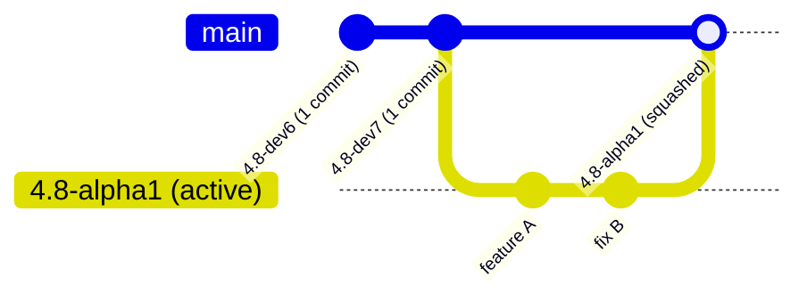

# Lapis Git Release Maintenance & Milestone Tagging Manual

This operational skill governs Git repository hygiene, branch management, and release tagging for the **Lapis for Crystal** project. It enforces the **single-commit-per-milestone invariant** to ensure clean commit graphs, predictable version charting, and synchronized remote branches.

---

## 1. Architectural Invariant: Single Commit per Release Milestone

To keep repository history clean and prevent GitHub from reporting "200+ commits ahead" or displaying cluttered graph branches:

1. **Every finalized release milestone branch and tag must contain exactly ONE commit for that milestone**:
   - The tree of that single commit contains 100% of the files and features finalized for that release.
   - The parent of the commit points directly to the previous milestone commit, creating an unbroken, linear history chain.
2. **Active milestone branches may accumulate iterative commits during development**:
   - Granular commits are permitted while features and fixes are actively being verified on CI.
   - Upon finalization and tagging, all iterative commits are squashed down into the single milestone commit.
3. **Branch & Tag Isolation**:
   - The milestone branch (e.g. `4.8-dev7`) and its release tag point to the exact same squashed commit hash.
   - **`master` Branch Protection**: The repository default branch (`master`) is strictly reserved for ceremonializing major stable releases. NEVER push, fast-forward, or force-update `master` or the `latest` tag during regular development milestone squashes (`dev`, `alpha`, `beta`, `rc`).
   - Only update `master` when the user explicitly instructs that a major stable release is being published.



---

## 2. Godot Version Tag Classification & Lifecycle Stages

Lapis tracks upstream Godot Engine release stages. When creating branches, tagging milestones, or running benchmarks, use the standardized stage nomenclatures:

<table>
  <thead>
    <tr>
      <th align="left">Stage</th>
      <th align="left">Format Pattern</th>
      <th align="left">Lifecycle &amp; Freeze State</th>
      <th align="left">Examples</th>
    </tr>
  </thead>
  <tbody>
    <tr>
      <td><strong>Development</strong></td>
      <td><code>X.Y-devN</code></td>
      <td>Active exploratory development, major subsystem refactoring, new C-API bindings.</td>
      <td><code>4.8-dev6</code>, <code>4.8-dev7</code></td>
    </tr>
    <tr>
      <td><strong>Alpha</strong></td>
      <td><code>X.Y-alphaN</code></td>
      <td>Feature freeze begins. Subsystem APIs are stabilized; binding generation locked down.</td>
      <td><code>4.8-alpha1</code>, <code>4.8-alpha2</code></td>
    </tr>
    <tr>
      <td><strong>Beta</strong></td>
      <td><code>X.Y-betaN</code></td>
      <td>Feature freeze complete. Intense bug squashing, performance benchmarks, and docs.</td>
      <td><code>4.8-beta1</code>, <code>4.8-beta3</code></td>
    </tr>
    <tr>
      <td><strong>Release Candidate</strong></td>
      <td><code>X.Y-rcN</code></td>
      <td>Production candidate. Only critical blocker bug fixes and security patches allowed.</td>
      <td><code>4.8-rc1</code>, <code>4.8-rc2</code></td>
    </tr>
    <tr>
      <td><strong>Stable</strong></td>
      <td><code>X.Y-stable</code> / <code>X.Y.Z-stable</code></td>
      <td>Official production shipping release. Long-term support baseline.</td>
      <td><code>4.8-stable</code>, <code>4.8.1-stable</code></td>
    </tr>
  </tbody>
</table>

---

## 3. Milestone Squashing & Release Runbook

Follow these exact steps when finalizing a release milestone:

### Step 1: Pre-Flight Verification & Quality Gates
Before squashing any branch, all tests and builds must pass green:
```powershell
# 1. Full compilation and synchronization
make all

# 2. Automated test suite execution
bin/lapis test --no-tui

# 3. Godot version matching verification
crystal run spec/godot_version_verification_spec.cr

# 4. Environment health check
bin/lapis doctor
```

### Step 2: Commit All Working Tree Changes
Ensure all uncommitted modifications are committed to the active milestone branch:
```powershell
git add -A
git commit -m "chore: prepare final release assets for <STAGE-VERSION>"
```

### Step 3: Create the Single Squashed Milestone Commit
Using `git commit-tree` guarantees 100% byte-for-byte tree identity with zero file loss:

```powershell
# For a root milestone (first milestone in the chain, e.g. 4.8-dev6):
$Tree = git rev-parse "HEAD^{tree}"
$Commit = git commit-tree $Tree -m "feat: Godot <VERSION> release (<SUMMARY OF FEATURES>)"

# For subsequent milestones (e.g. 4.8-dev7 with parent 4.8-dev6):
$ParentCommit = git rev-parse "refs/heads/<PREVIOUS_VERSION>"
$Tree = git rev-parse "HEAD^{tree}"
$Commit = git commit-tree $Tree -p $ParentCommit -m "feat: Godot <VERSION> release (<SUMMARY OF FEATURES>)"
```

### Step 4: Update Branch and Release Tags Locally
Reset the current branch and point release tags to the new squashed commit:
```powershell
# Reset current branch to the squashed commit
git reset --hard $Commit

# Update branch ref and version tag
git branch -f <VERSION> $Commit
git tag -f <VERSION> $Commit

# Update floating latest tag and master branch
git tag -f latest $Commit
git branch -f master $Commit
```

### Step 5: Verify Tree Integrity & Commit Counts
Mathematically verify zero file drift and exact commit counts:
```powershell
# 1. Commit count of target milestone branch relative to its parent (MUST be 1):
git rev-list --count refs/heads/<PREVIOUS_VERSION>..refs/heads/<VERSION>
# Expected: 1

# 2. Tree diff against pre-squash HEAD (MUST produce zero output):
git diff ORIG_HEAD HEAD
# Expected: (empty)
```

### Step 6: Push to Remote & Tags
Force-push the finalized milestone branch and its release tag to GitHub (do NOT push to `master`):
```powershell
git push -f origin <VERSION>
git push -f origin refs/tags/<VERSION>

# IMPORTANT: NEVER push to master or latest tag!
# master is strictly reserved for ceremonializing major stable releases.
```

---

## 4. Starting a New Milestone Branch

When transitioning from a finalized milestone (e.g. `4.8-dev7`) to the next milestone (e.g. `4.8-alpha1` or `4.8-dev8`):

1. **Check Out from Previous Finalized Milestone**:
   ```powershell
   git checkout -b <NEW_VERSION> <PREVIOUS_VERSION>
   ```
2. **Update Version Configuration**:
   - Update `godot-version.yml`:
     ```yaml
     version: "<NEW_VERSION>"
     ```
   - Update `src/bridge/godot_version.h`:
     ```c
     #define LIBGODOT_TARGET_VERSION "<NEW_VERSION>"
     ```
   - If Lapis CLI has a new release, bump `version` in `tools/lapis/shard.yml` and `tools/lapis/src/version.cr`.
3. **Verify Version Alignment**:
   ```powershell
   crystal run spec/godot_version_verification_spec.cr
   ```
4. **Create Initial Milestone Commit & Push Tracking Branch**:
   ```powershell
   git commit -am "chore: start <NEW_VERSION> development cycle"
   git push -u origin <NEW_VERSION>
   ```

---

## 5. Auditing & Diagnostic Commands

Use these commands to verify repository health and diagnose commit inflation:

<table>
  <thead>
    <tr>
      <th align="left">Audit Goal</th>
      <th align="left">Command</th>
      <th align="left">Expected Result</th>
    </tr>
  </thead>
  <tbody>
    <tr>
      <td>Milestone Commit Count</td>
      <td><code>git rev-list --count refs/heads/4.8-dev6</code></td>
      <td><code>1</code> (for root milestone)</td>
    </tr>
    <tr>
      <td>Delta between Milestones</td>
      <td><code>git rev-list --count refs/heads/4.8-dev6..refs/heads/4.8-dev7</code></td>
      <td><code>1</code> (exactly 1 commit ahead)</td>
    </tr>
    <tr>
      <td>Inspect Commit Graph</td>
      <td><code>git log --graph --oneline --decorate -n 10</code></td>
      <td>Clean linear sequence with tags aligned</td>
    </tr>
    <tr>
      <td>Verify Remote Status</td>
      <td><code>git status -uno</code></td>
      <td><code>Your branch is up to date with 'origin/...'</code></td>
    </tr>
    <tr>
      <td>Check Tag Ambiguity</td>
      <td><code>git show-ref 4.8-dev7</code></td>
      <td>Both branch and tag point to identical commit hash</td>
    </tr>
  </tbody>
</table>

---

## 6. Disaster Recovery / Rollback Protocol

If a squash or reset was performed erroneously before pushing:
1. Locate the pre-squashed commit hash in Git's reference log:
   ```powershell
   git reflog -n 20
   ```
2. Restore the branch to the exact pre-squashed commit:
   ```powershell
   git reset --hard <PRE_SQUASH_HASH>
   ```
3. Re-verify the workspace with `git status` and `make all`.
